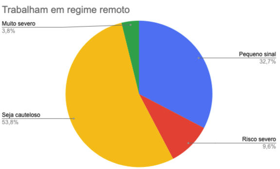
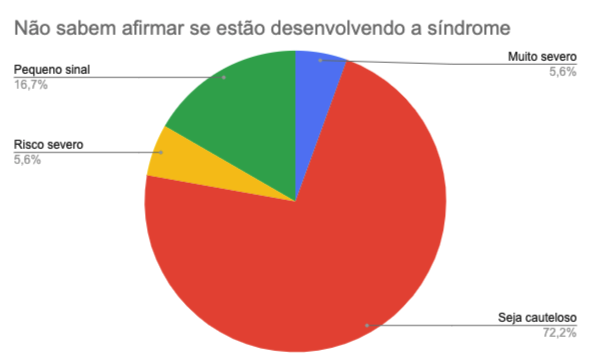

## Pesquisa
O site foi idealizado a partir de uma análise sobre a síndrome de Burnout em colaboradores de startups brasileiras. Você pode conferir o trabalho final [aqui](https://docs.google.com/document/d/1-FtrN3-aH_cPzqITO1ON8eXR2BYYs7Qd0X19KK04qg8/edit#)

A pesquisa foi executada de forma anônima e os dados podem ser encontrados [aqui](https://docs.google.com/spreadsheets/d/1BzIDT1kji4DV7x7Oau0-l3278Kei58g9VqivA8T8FYc/edit?resourcekey#gid=571045632)

A análise corresponde à execução de um teste que conta com 21 perguntas e têm como objetivo classificar o respondente em 5 grupos:

- Sem sinais da síndrome
- Pequeno sinal da síndrome
- Seja cauteloso
- Risco severo
- Risco muito severo

**Importante ressaltar que o teste não deve ser tratado como diagnóstico, mas sim uma forma de auxiliar a pessoa a entender se está apresentando sinais da síndrome.**

### Resultados

- Pode-se observar que, 80,3% das pessoas que responderam atuam em regime de trabalho remoto
- 54,5% das pessoas que responderam pontuaram as perguntas conceituais de forma a serem consideradas em estado de cautela.
- Nenhuma pessoa que respondeu, atingiu um conceito abaixo de pequenos sinais da síndrome.
- 31,8% das pessoas que responderam estão no patamar de pequenos sinais, 13,7% fazem parte do grupo de situações severas.

#### Através dos dados fundamentais buscou-se estabelecer as correlações de:

- ##### Qual a diferença da incidência de severidade da síndrome de burnout entre pessoas que trabalham no ambiente de startup de tecnologia remotamente e pessoas que trabalham no ambiente de startup de tecnologia presencialmente?

É importante salientar que 80,3% dos respondentes trabalham remotamente em suas startups. A análise das respostas mostra que 13,4% das pessoas que trabalham remotamente estão classificadas sobre o risco de desenvolver a síndrome de burnout como severo ou acima, já nas pessoas que trabalham presencialmente ao menos uma vez pela semana essa taxa sobe para 21,4%.

- ##### Qual o percentual de pessoas que trabalham no ambiente de startup de tecnologia que não compreendem a síndrome de burnout para entenderem se estão em um limiar perigoso para sua saúde psicológica?

Sobre o percentual de pessoas que trabalham em startups e que não sentem que têm informação suficiente para entender o que é síndrome de burnout e se estão no processo de desenvolve-la, foi possível observar que aproximadamente 28,79% dos respondentes consideram-se nessa situação, e que desse percentual, 72,2% das pessoas têm seu estado psicológico associado à cautela, e apenas 16,7% apresentam pequenos sinais do densenvolvimento da síndrome.

- ##### Qual a relação de severidade entre pessoas que trabalham no ambiente de startup de tecnologia que nunca foram acometidas pela síndrome e das pessoas que já foram?

Acerca da relação de severidade entre pessoas que trabalham em startups de tecnologia e que já foram acomedidas pela síndrome de burnout pelo menos uma vez, foi possível observar que embora já tenham passado pela situação, as taxas de pessoas que tiveram seu estado classificado como severo ou muito severo é de 10,7% e 14,3% respesctivamente. Representando um aumento de 3,1% e 8,2% em relação à média de classificação geral. Isso demonstra como as pessoas ainda têm pouca maturidade e acesso à informação quando fala-se da síndrome de burnout. Ou seja, apesar de já terem sido acomedidas pela síndrome, não significa que desenvolveram ferramentas para identificar ou tratar o caso.

### Referências

As perguntas bases que envolvem saúde psicológica foram retiradas do site focado em saúde psicológica [MindTools](https://www.mindtools.com/pages/article/newTCS_08.htm)